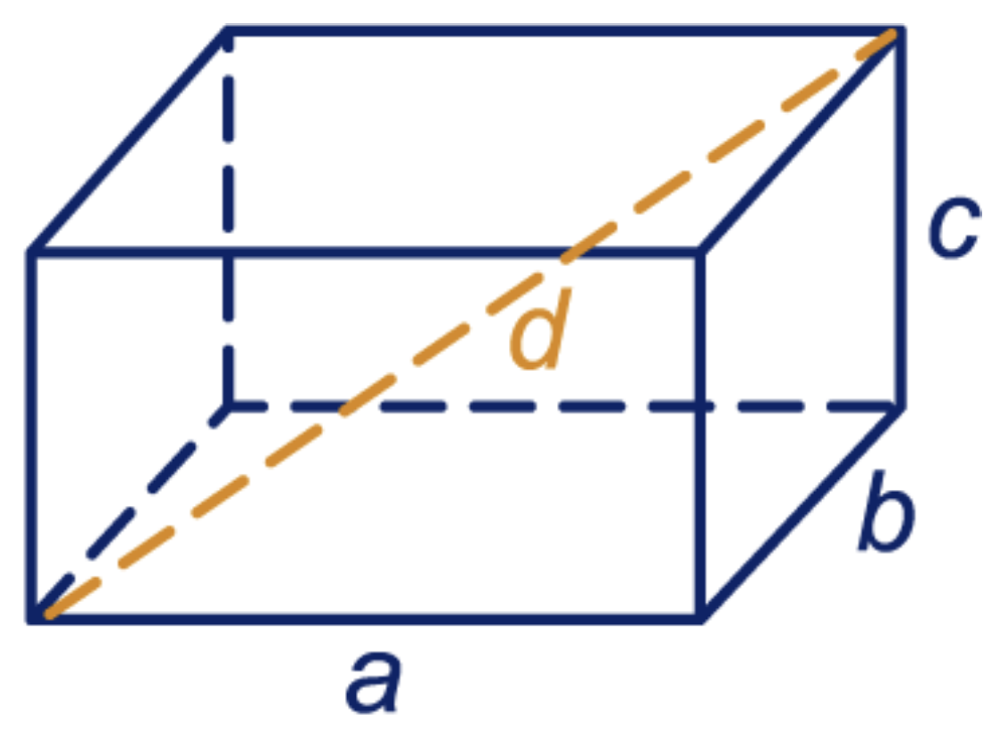

Gegeven twee punten op een assenstelsel, kan je de afstand tussen de twee punten aan de hand van hun coördinaten berekenen met de onderstaande formule:

Gegeven een balk waarvan de basis, hoogte en diepte gegeven zijn. Dan kan je de lengte van de diagonaal van de balk berekenen met de onderstaande formule:

$$d=\sqrt{a^2+b^2+c^2}$$

Hierbij zijn...
- $$a$$, $$b$$ en $$c$$ de basis, hoogte en diepte van de balk.
- $$d$$ de lengte van de diagonaal van de balk.
- 
<!-- 

https://images.app.goo.gl/you8otaUkh3m8r1n9 -->


Schrijf een programma dat de basis, hoogte en diepte vraagt en de lengte van de diagonaal teruggeeft.

## Invoer

- Een reëel getal $$a$$
- Een reëel getal $$b$$
- Een reëel getal $$c$$

## Uitvoer

- Een reëel getal, de lengte van de diagonaal.

## Voorbeelden

```
>>> 1
>>> 2
>>> 2
3.0

>>> 2
>>> 3
>>> 6
7.0
```


